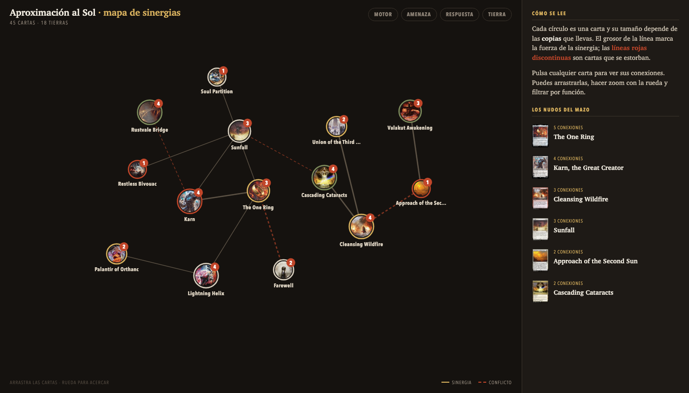
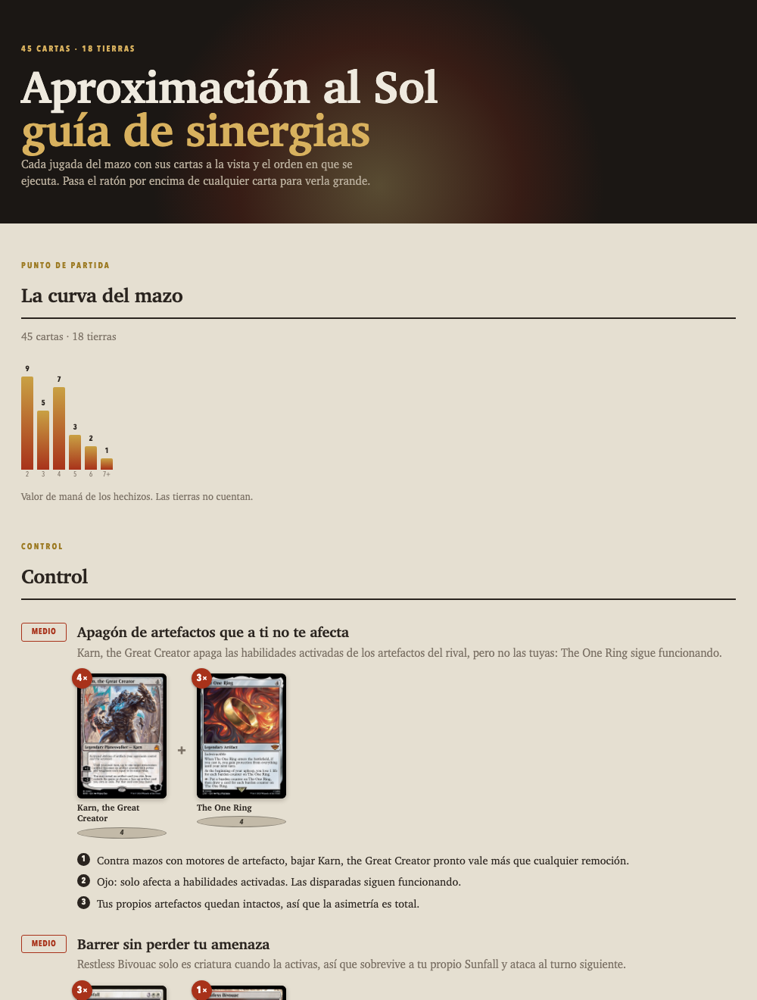
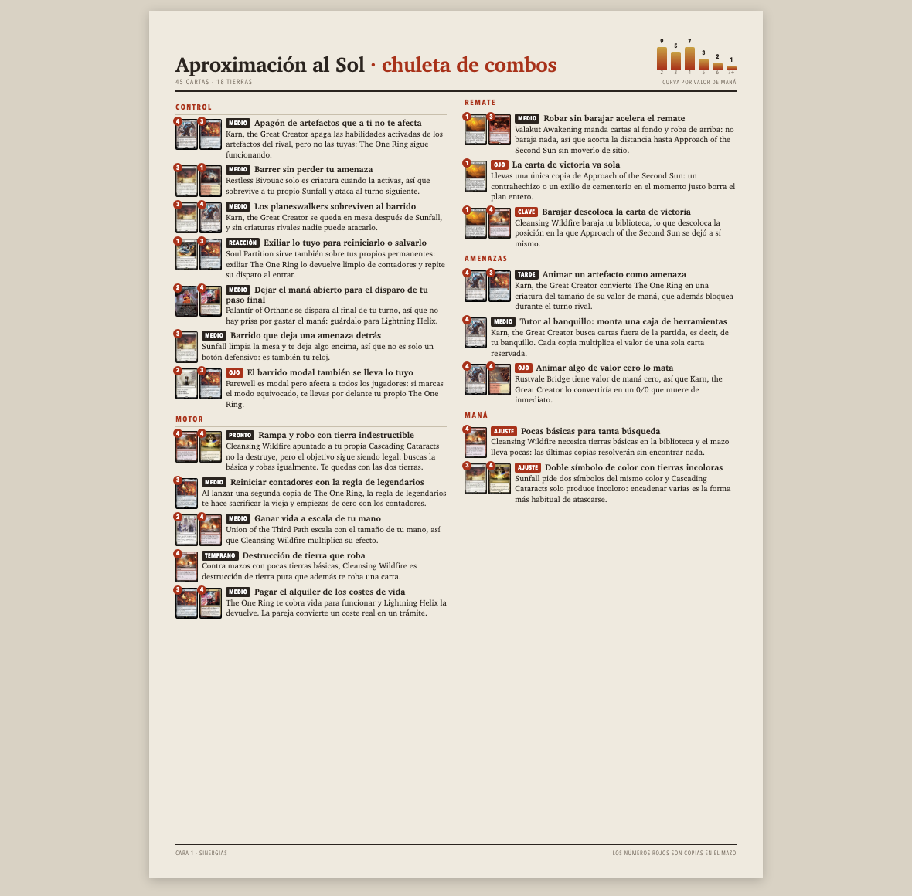

# MTG Forja

Analiza un mazo de **Magic: The Gathering** y genera tres cosas: una guía extensa de
sinergias, una chuleta imprimible de dos caras y un mapa interactivo navegable.

Funciona de tres maneras: como **servidor MCP** dentro de Claude, como **herramienta de
línea de comandos** y como **web** que corre entera en el navegador.

> La premisa: las interacciones se comprueban contra el texto de oráculo real que
> devuelve [Scryfall](https://scryfall.com), nunca contra lo que un modelo de lenguaje
> cree recordar. Los cuatro errores que originaron este proyecto —una carta que se creía
> que barajaba y mandaba al fondo, una tierra indestructible tomada por condicional— son
> exactamente los que el motor detecta bien.

---

## Qué genera

Pegas una lista de mazo y salen tres documentos HTML autónomos. Estas capturas son
salida real del mazo de ejemplo: 45 cartas y 28 sinergias detectadas.

### El mapa del mazo

Un grafo de fuerzas navegable: cada círculo es una carta, su tamaño depende de cuántas
copias llevas y el grosor de la línea marca la fuerza de la sinergia. Las **líneas rojas
discontinuas** son cartas que se estorban entre sí. Puedes pulsar cualquier carta para
aislar sus conexiones, arrastrarlas y hacer zoom.

Salen **todas** las cartas del mazo, también las que no tienen ninguna relación detectada:
una tierra suelta dice algo del mazo, y esconderla no.

Los filtros por función son **acumulables** — enciende varios y verás lo que encaje en
cualquiera de ellos. Y el botón **Ajustes** controla la densidad de la red:

| Mando | Para qué |
|---|---|
| **Conexiones por carta** | Recorta la maraña dejando lo más fuerte de cada carta |
| **Fuerza mínima** | Esconde las sinergias flojas |
| **Solo conflictos** | Deja el mapa únicamente con los avisos |

El motor sigue calculando todas las sinergias; esto solo decide cuáles se dibujan. **Los
conflictos no se ocultan con ningún ajuste**, porque avisar es el trabajo principal del mapa.



### La guía de sinergias

Página larga con cada jugada desarrollada: las piezas ilustradas, la secuencia numerada
de ejecución, los avisos y el mazo completo agrupado por función. Pensada para leerla
una vez y entender el mazo.



### La chuleta

Dos caras A4 densas, sin literatura, para imprimir y tener al lado mientras juegas.
Cada línea es una interacción con sus cartas en miniatura y cuándo aplica.



---

## De qué se compone

| Pieza | Qué es | Su papel aquí |
|---|---|---|
| `reglas.json` | 37 patrones de interacción escritos a mano | **Lo que alguien enseñó.** Profundo pero estrecho: solo encuentra lo que está escrito. |
| Commander Spellbook | Base externa de combos curados | **Lo que otros catalogaron.** Combos con nombre propio y pasos redactados. Consultada bajo petición, cacheada, y siempre a contrastar contra el oráculo. |
| `lexico.json` | 31 conceptos de recurso | **Lo que se deduce.** No describe parejas de cartas sino recursos: quién los produce, quién los premia y quién los rompe. Cubre cualquier mazo, aunque más en superficie. |
| El motor | `reglas.py` y su gemelo `motor.js` | Cruza el mazo con los patrones y devuelve las candidatas, cada una **con la frase de oráculo que la disparó**. |
| `scryfall.py` | Cliente de Scryfall, con caché en disco | **La fuente de verdad.** Oráculo real y **rulings oficiales de Wizards** — el contenido de Gatherer. Todo lo que se afirma sale de aquí. |
| Los renderizadores | `guia.js`, `chuleta.js`, `grafo.js` | Convierten el análisis en HTML autónomo. Una sola implementación, compartida por la web y la terminal. |
| El servidor MCP | `server.py` | **El enchufe con Claude.** Expone las herramientas para que el modelo pueda llamarlas. |
| Las herramientas | Once funciones — [tabla completa abajo](#herramientas-mcp) | Lo que Claude *puede hacer*: resolver, detectar, listar reglas, renderizar cada documento. |
| La skill | `skill/SKILL.md` | Lo que Claude *debe saber*: qué verificar antes de afirmar nada, qué documento pide cada situación, cómo redactar. |
| El CLI | `cli.py` | Los mismos tres documentos sin pasar por Claude. |
| La web | `docs/` | Todo lo anterior en el navegador, sin instalar nada. |

**Qué es MCP.** El Model Context Protocol es un estándar abierto para que un modelo pueda
llamar a programas externos. Aquí el reparto es deliberado: **el servidor aporta los
hechos, el modelo aporta el criterio.** Por eso `detectar_sinergias` no devuelve prosa
cerrada, sino candidatas con su evidencia: los datos los pone el motor, la redacción y el
juicio los pone Claude.

**Qué es la skill.** Un archivo de instrucciones que Claude lee cuando la tarea lo pide.
Si las herramientas le dan *capacidad*, la skill le da *criterio*: le prohíbe afirmar nada
de memoria, le dice cuándo generar cada documento y cómo escribir los pasos. Funciona sin
ella; con ella los análisis salen bastante mejor.

### Qué necesitas según cómo lo uses

| Si lo usas… | Te hace falta |
|---|---|
| Desde la web | Nada — solo el navegador |
| Desde la terminal | Python y el paquete |
| Desde Claude | Python, el paquete y el conector MCP · la skill es opcional y recomendada |

---

## Instalación

Elige el camino según cómo quieras usarlo. **La web no requiere instalar nada**; el resto
depende de si quieres usarlo desde Claude o desde la terminal.

| Quiero… | Ve a |
|---|---|
| Probarlo ahora mismo, sin instalar | [La web](#la-web-nada-que-instalar) |
| Pedírselo a Claude en lenguaje natural | [Claude Desktop](#claude-desktop) · [Claude Code](#claude-code) |
| Usarlo desde otro programa con soporte MCP | [Otros clientes MCP](#otros-clientes-mcp) |
| Generar los HTML desde la terminal | [Línea de comandos](#línea-de-comandos) |

### Requisito previo (salvo para la web)

Todo lo demás necesita **Python 3.10 o superior**. La forma más cómoda de ejecutarlo es
con [`uv`](https://docs.astral.sh/uv/), que descarga y aísla el proyecto por ti sin que
tengas que crear entornos a mano:

```bash
curl -LsSf https://astral.sh/uv/install.sh | sh
```

En macOS también vale `brew install uv`. Si prefieres no instalar `uv`, más abajo tienes
[la alternativa con `pip`](#alternativa-sin-uv).

---

### La web (nada que instalar)

<https://grutino.github.io/mtg-forja/>

Pegas la lista, pulsas **Analizar mazo** y sale el mapa. Desde ahí, los botones **Guía** y
**Chuleta** generan los otros dos documentos. Todo ocurre en tu navegador; no se envía nada
a ningún servidor salvo la consulta de cartas a Scryfall. Es la forma más rápida de ver si
el proyecto te sirve.

> Los archivos que descarga la web son **exactamente los mismos** que genera la línea de
> comandos: el mismo renderizador, incrustado en un HTML autónomo.

---

### Claude Desktop

1. Abre el archivo de configuración de conectores:
   - **macOS**: `~/Library/Application Support/Claude/claude_desktop_config.json`
   - **Windows**: `%APPDATA%\Claude\claude_desktop_config.json`
   - **Linux**: `~/.config/Claude/claude_desktop_config.json`

   Si no existe, créalo con ese contenido. Si ya tienes otros conectores, añade solo la
   entrada `"mtg-forja"` dentro del `mcpServers` que ya tengas.

2. Pega esto:

```json
{
  "mcpServers": {
    "mtg-forja": {
      "command": "uvx",
      "args": ["--from", "git+https://github.com/grutino/mtg-forja", "mtg-forja-mcp"],
      "env": { "MTG_FORJA_SALIDA": "/ruta/donde/quieres/los/html" }
    }
  }
}
```

   Cambia `/ruta/donde/quieres/los/html` por una carpeta tuya real (por ejemplo
   `/Users/tunombre/Documents/mazos`). Ahí es donde aparecerán los documentos generados.

3. **Cierra Claude Desktop del todo y vuelve a abrirlo.** No basta con cerrar la ventana.

4. Comprueba que ha cargado: en el icono de conectores debe aparecer `mtg-forja` con sus
   nueve herramientas. Si no sale, mira [Si algo falla](#si-algo-falla).

5. Instala además la skill de [`skill/SKILL.md`](skill/SKILL.md) para que Claude sepa
   **cómo** usar las herramientas: qué verificar, cómo redactar los pasos y cuándo
   generar cada documento. Sin ella funciona, pero con ella los textos salen bastante
   mejor.

---

### Claude Code

Desde la terminal, en cualquier carpeta:

```bash
claude mcp add mtg-forja --scope user --env MTG_FORJA_SALIDA=/ruta/donde/quieres/los/html -- uvx --from git+https://github.com/grutino/mtg-forja mtg-forja-mcp
```

`--scope user` lo deja disponible en todos tus proyectos. Si prefieres tenerlo solo en un
proyecto concreto, usa `--scope project`: se guardará en un `.mcp.json` en la raíz del
repositorio, que puedes commitear para que lo tenga todo tu equipo.

Ese `.mcp.json` es exactamente el mismo formato que el de Claude Desktop, así que también
puedes escribirlo a mano:

```json
{
  "mcpServers": {
    "mtg-forja": {
      "command": "uvx",
      "args": ["--from", "git+https://github.com/grutino/mtg-forja", "mtg-forja-mcp"],
      "env": { "MTG_FORJA_SALIDA": "/ruta/donde/quieres/los/html" }
    }
  }
}
```

---

### Otros clientes MCP

El servidor habla **MCP sobre stdio**, que es el transporte estándar. Sirve tal cual en
cualquier programa que soporte MCP —Cursor, Windsurf, Zed, VS Code con una extensión
compatible, LM Studio y demás—. Casi todos usan el mismo formato que Claude Desktop; si
el tuyo pide los campos por separado, esta es la equivalencia:

| Campo | Valor |
|---|---|
| Transporte | `stdio` |
| Comando | `uvx` |
| Argumentos | `--from` · `git+https://github.com/grutino/mtg-forja` · `mtg-forja-mcp` |
| Variable de entorno | `MTG_FORJA_SALIDA` = la carpeta donde quieres los HTML |

Consulta la documentación de tu cliente para saber dónde vive su archivo de configuración;
el bloque `mcpServers` de arriba suele copiarse sin cambios.

#### Alternativa sin `uv`

Si no quieres instalar `uv`, instala el paquete en un entorno propio y apunta al ejecutable
por su ruta absoluta:

```bash
python3 -m venv ~/.venvs/mtg-forja
~/.venvs/mtg-forja/bin/pip install git+https://github.com/grutino/mtg-forja
```

Y en la configuración, en lugar de `uvx`:

```json
{
  "mcpServers": {
    "mtg-forja": {
      "command": "/Users/tunombre/.venvs/mtg-forja/bin/mtg-forja-mcp",
      "args": [],
      "env": { "MTG_FORJA_SALIDA": "/ruta/donde/quieres/los/html" }
    }
  }
}
```

Usa siempre la ruta absoluta: los clientes MCP no heredan tu `PATH`, y ese es el motivo
más común de que un servidor no arranque.

---

### Línea de comandos

Sin instalar nada de forma permanente:

```bash
uvx --from git+https://github.com/grutino/mtg-forja mtg-forja mazo.txt -n "Mi mazo" -o salida
```

O instalándolo de una vez:

```bash
pip install git+https://github.com/grutino/mtg-forja
mtg-forja mazo.txt -n "Mi mazo" -o salida
```

Genera `salida/guia.html`, `salida/chuleta.html` y `salida/mapa.html`.

---

## Cómo se usa

### Desde Claude

Una vez instalado el conector, pídeselo en lenguaje natural y pégale la lista:

> «Analiza este mazo y hazme el mapa y la chuleta:
> 4 Cleansing Wildfire
> 4 Cascading Cataracts
> …»

Claude resolverá las cartas contra Scryfall, buscará los patrones de interacción y
generará los HTML en la carpeta que pusiste en `MTG_FORJA_SALIDA`. Vale el formato de
exportación de MTG Arena, Moxfield, Archidekt, MTGO, el CSV de ManaBox, o una carta por línea.

Cosas que puedes pedirle, ya que las herramientas están separadas a propósito:

- «¿Qué sinergias detecta este mazo?» — solo el análisis, sin generar documentos.
- «Enséñame las reglas que conoce el motor» — el catálogo de patrones.
- «Genérame solo la chuleta» — un único documento.
- «¿Por qué dice que estas dos cartas se estorban?» — cada sinergia viene con **la frase
  de oráculo exacta que la disparó**, así que puedes auditar el razonamiento.

### Desde la línea de comandos

```bash
mtg-forja mazo.txt -n "Mi mazo" -o salida
```

| Opción | Qué hace |
|---|---|
| `mazo.txt` | Archivo con la lista. Usa `-` para leer de la entrada estándar. |
| `-n`, `--nombre` | Nombre del mazo, el que sale en los títulos. |
| `-o`, `--salida` | Carpeta de destino. |
| `--json` | Vuelca además el documento en JSON, por si quieres procesarlo tú. |

Abre los tres HTML en el navegador. Son autónomos: puedes moverlos, enviarlos por correo
o imprimir la chuleta directamente desde el navegador.

### Desde la web

1. Entra en <https://grutino.github.io/mtg-forja/>
2. Pega la lista, o pulsa **Cargar ejemplo** para ver cómo funciona con un mazo de prueba.
3. Pulsa **Analizar mazo**.
4. Pulsa cualquier carta del grafo para aislar sus conexiones; arrastra para recolocar,
   rueda del ratón para acercar y los botones de arriba para filtrar por función.
5. Los botones **Guía** y **Chuleta**, arriba a la derecha, abren esos documentos en una
   pestaña nueva. Guárdalos con Ctrl/Cmd + S, o imprime la chuleta directamente: está
   maquetada en A4 y sale bien del navegador sin tocar nada.

---

## Si algo falla

| Síntoma | Causa habitual |
|---|---|
| El conector no aparece en Claude | No reiniciaste del todo la aplicación; ciérrala por completo y vuelve a abrirla. |
| «command not found: uvx» en los logs | `uv` no está instalado, o el cliente no ve tu `PATH`. Usa [la alternativa sin `uv`](#alternativa-sin-uv) con ruta absoluta. |
| El JSON no se acepta | Suele ser una coma de más o de menos. Pégalo en un validador de JSON. |
| Los HTML no aparecen | `MTG_FORJA_SALIDA` apunta a una carpeta que no existe. Créala o cambia la ruta. |
| Una carta sale «sin resolver» | Revisa la grafía del nombre. Los acentos no importan, pero un nombre mal escrito sí. |
| Las imágenes de carta tardan | Se piden a Scryfall según hacen falta. Con conexión lenta se ven en gris un momento. |

---

## Herramientas MCP

| Herramienta | Qué hace |
|---|---|
| `resolver_mazo` | Resuelve la lista contra Scryfall y devuelve el oráculo real. |
| `radiografia_del_mazo` | Los hechos objetivos: a quién alcanza cada efecto, qué tipos menciona, qué zonas toca, y si el mazo tiene fuentes de color para lo que él mismo exige. |
| `detectar_sinergias` | Busca patrones de interacción y devuelve candidatas **con la frase de oráculo que disparó cada una**. |
| `combos_conocidos` | Combos ya catalogados por [Commander Spellbook](https://commanderspellbook.com), con sus pasos. **Única fuente que no es oráculo verificado**: hay que contrastarla. |
| `listar_reglas` | Enseña los patrones que conoce el motor. |
| `render_guia` / `render_chuleta` / `render_mapa` | Generan cada HTML a partir del documento. |
| `analizar` | Atajo: hace todo de una pasada con los textos automáticos. |

El reparto es deliberado: **el servidor aporta los hechos, el modelo aporta el criterio.**
Por eso `detectar_sinergias` devuelve borradores con evidencia en lugar de prosa cerrada.

---

## Cómo funciona el motor

`src/mtg_forja/reglas.json` es una lista de **patrones genéricos de interacción**. No sabe
nada de cartas concretas: describe formas. Por ejemplo, «una carta que destruye una tierra
y roba» más «una tierra indestructible» es una sinergia de rampa, se llamen como se llamen.

```json
{
  "id": "tierra-indestructible-cantrip",
  "nombre": "Rampa y robo con tierra indestructible",
  "fuerza": 3,
  "piezas": [
    {"rol": "a", "oracle": "destroy target land",
     "oracle2": "search their library for a basic land", "oracle3": "draw a card"},
    {"rol": "b", "tipo": "Land", "oracle": "indestructible"}
  ],
  "resumen": "{a} apuntado a tu propia {b} no la destruye, pero…"
}
```

Campos disponibles en cada pieza: `oracle`, `oracle2`, `oracle3`, `no_oracle`, `tipo`,
`no_tipo`, `coste`, `mv_min`, `mv_max`, `copias_min`, `copias_max`. A nivel de regla,
`conteo` permite condiciones sobre el mazo entero (`basicas`, `tierras`, `total`).

**Añadir una regla es añadir un objeto a esa lista.** Nada más. Se usa igual desde
Python y desde el navegador, porque las dos mitades leen el mismo archivo.

### La segunda capa: el léxico de recursos

Escribir una regla por cada pareja de cartas que interactúa no escala a treinta mil
naipes. Por eso hay un segundo motor que trabaja al revés: `src/mtg_forja/lexico.json`
no describe parejas, describe **recursos**. De cada carta deduce qué produce, qué premia
y qué rompe.

```json
{
  "id": "cementerio",
  "nombre": "el cementerio",
  "fuerza": 3,
  "produce": {"oracle": ["\\bmills?\\b", "discard(s)? (a|your|two)"],
              "no_oracle": "exile(s)? .{0,40}graveyard",
              "texto": "llena tu cementerio"},
  "premia":  {"oracle": ["\\bDelve\\b", "cards? in your graveyard"],
              "texto": "se alimenta del cementerio"},
  "rompe":   {"oracle": ["exile(s)? .{0,40}graveyard"],
              "texto": "vacía los cementerios"}
}
```

Las sinergias no se escriben, **se deducen**: si A produce un recurso y B lo premia, hay
sinergia; si A lo rompe y B depende de él, hay conflicto. Un concepto cubre de golpe todas
las parejas que lo compartan, así que el esfuerzo crece con las mecánicas del juego y no
con el número de mazos. Hoy son **24 conceptos** frente a 37 reglas escritas.

Cada bloque acepta los mismos campos que una pieza de regla (`oracle`, `no_oracle`, `tipo`,
`no_tipo`, `mv_min`, `mv_max`), y `texto` es lo que se lee en el resumen.

Dos cosas que se aprendieron a base de falsos positivos, y que el motor ya hace por ti:
ignora el **texto recordatorio** entre paréntesis (el de retrospectiva de Snapcaster Mage
dice «exile it» y la carta pasaba por odio al cementerio) y quita el **nombre propio** de
la carta antes de analizar (Lightning Storm casaba con la mecánica *Tormenta*).

### Hasta dónde llega cada camino

Conviene decirlo claro, porque determina qué esperar:

| Camino | Alcance | Profundidad |
|---|---|---|
| Reglas escritas (`reglas.json`) | solo los arquetipos que alguien escribió | **alta** — ve asimetrías y casos raros |
| Léxico de recursos (`lexico.json`) | **cualquier mazo** | baja — solo flujos de recursos |
| Modelo vía MCP | **cualquier mazo** | **alta** — es como se hizo el análisis original |

Las reglas escritas no salieron de un motor: salieron de un modelo leyendo el oráculo de
cada carta y razonando, y luego alguien congeló esas conclusiones. Por eso ningún motor
de patrones las reproduce. Comprobado: sobre el mazo que originó el proyecto, el léxico
redescubre **1 de las 18** parejas escritas a mano.

Lo que ningún motor puede ver, y sí ve un modelo con el oráculo delante:

- «apaga los artefactos del rival, **pero no los tuyos**» — requiere entender la asimetría
- «el barrido no alcanza a tus planeswalkers» — requiere inferir qué queda **fuera**
- «esa tierra solo es criatura cuando la activas, así que sobrevive» — estados temporales
- «barajar descoloca la carta que pusiste arriba» — posición en la biblioteca

Por eso la herramienta `radiografia_del_mazo` existe: le da al modelo esos hechos —alcance,
tipos que menciona, zonas que toca— para que pueda razonar en vez de adivinar.

**Si quieres el análisis bueno de un mazo que nadie ha visto, usa el camino MCP.** El CLI
y la web no tienen un modelo detrás; ahí el léxico sirve de suelo, para que un mazo
desconocido nunca devuelva una página casi vacía.

### ¿Y las colecciones nuevas?

El léxico no describe cartas ni colecciones: describe **recursos**. Una carta nueva
que llene el cementerio, haga fichas o premie a los dragones encaja en conceptos que
ya existen, salga en la colección que salga.

Medido sobre **525 cartas reales de 2023 en adelante**: el motor lee el **98 %**.
Lo que no entiende son equipos y auras que solo dan +X/+X, que apenas tienen señal
de sinergia.

Lo que sí se escapa es una mecánica **genuinamente nueva** — *Ferocious* pide
«controlas una criatura de fuerza 4 o más», y sin un concepto para eso un mazo
entero se queda mudo. Suelen ser dos o tres por colección.

Para no depender de que alguien se dé cuenta:

```bash
python scripts/auditar_cobertura.py --minimo 25
```

Pregunta a Scryfall qué mecánicas existen hoy, cuántas cartas usa cada una, y avisa
de las que ningún concepto menciona. De las 371 del juego, 295 tienen menos de veinte
cartas: son residuales de colecciones antiguas. Las que merecen un concepto son unas
quince, y el guion las ordena por uso real.

Hay además una acción que lo ejecuta **cada lunes** y abre un aviso en el repositorio
si aparece algo nuevo que se use de verdad.

### Cómo saber si TU mazo está bien analizado

Un porcentaje de cobertura puede mentir. El caso real que lo enseñó: un mazo de
dragones daba «100 %, el motor cubre las mecánicas de este mazo» mientras la carta
que lo sostenía —una que abarata las criaturas con volar— aparecía en el mapa
**completamente suelta**, sin una sola línea.

Las dos razones, y las dos están corregidas:

1. Volar estaba en la lista de «palabras de combate que no definen sinergias».
   Es cierto hasta que una carta se fija en ellas; entonces es el eje del mazo.
2. La mecánica *Flurry* («lanzas tu segundo hechizo del turno») no la etiqueta
   Scryfall como palabra clave, así que ningún recuento la veía. Y tiene menos de
   25 cartas en todo Magic: la auditoría global tampoco la habría sacado nunca,
   aunque en ese mazo concreto fuera la mitad de la lista.

La lección es que **contar mecánicas no mide comprensión**. La señal que sí la mide
es la que se ve de un vistazo en el mapa, y ahora sale también en el informe:

    cartas_sin_relacion: ["Momo, Friendly Flier", ...]

Si una carta importante del mazo sale ahí, falta un concepto. Es la comprobación
que conviene hacer con cualquier mazo de una colección recién salida.

### Un aviso falso es peor que ningún aviso

La regla «doble símbolo de color con tierras incoloras» decía *solo produce
incoloro* pero nunca comprobaba lo de **solo**. `Maelstrom of the Spirit Dragon`
dice «Add {C}», y también «{T}: Add one mana of any color» sin coste extra, para
pagar dragones. El motor avisaba contra los tres dragones a los que esa tierra
existe justo para lanzar.

Salió a la luz al emitir todas las parejas: pasó de una línea roja a tres, y tres
ya cantaban. Ahora la regla exige que la tierra no produzca color gratis. El aviso
legítimo sigue: `Cascading Cataracts` cobra `{5}` por el color, así que en los
primeros turnos es incolora de verdad.

### Una regla, todas las cartas que encajen

Las reglas escritas a mano ya eran genéricas —«cualquier tierra indestructible», no
una carta concreta— pero el motor emitía **una sola pareja por regla**: elegía la
carta más representativa del papel y descartaba el resto.

En el mazo de ejemplo hay dos tierras indestructibles. Cascading Cataracts se
llevaba la única línea y Rustvale Bridge, de la que van cuatro copias, colgaba
suelto en el mapa pese a hacer exactamente la misma jugada:

> Apuntas `Cleansing Wildfire` a tu propia tierra indestructible. No se destruye,
> pero el objetivo sigue siendo legal: buscas la básica y robas igualmente.

Ahora una regla emite todas las combinaciones que encajen, con un tope de doce por
regla para que una laxa no llene el mapa. Es el mismo arreglo que ya se hizo en el
léxico cuando una carta eje aparecía con dos de sus seis compañeros.

### La trampa de las palabras clave

El texto entre paréntesis de una carta —el recordatorio— se descarta antes de
analizarla, porque repite reglas genéricas y disparaba falsos positivos. El precio
es sutil: en una mecánica con nombre, **el significado vive justo ahí**.

`Voice of Victory` dice «Mobilize 2», y todo lo demás —que crea dos fichas de
criatura al atacar— está en el recordatorio. El motor veía una palabra sin
contenido, y una carta de la que llevas cuatro copias colgaba de un solo hilo.

Por eso los conceptos reconocen también el **nombre** de la mecánica, no solo su
efecto redactado: `Mobilize`, `Amass`, `Fabricate`, `Populate`, `Ferocious`,
`Flurry`. Es la forma de que una palabra clave nueva entre con una línea de más.

No todas merecen concepto, y decir que no también es una decisión:

| Mecánica | ¿Concepto? | Por qué |
|---|---|---|
| `Mobilize` | Sí | Crea fichas de criatura: recurso claro |
| `Warp` | No | Solo se relanza a sí misma. Meterla inventaría relaciones de «parpadeo tus permanentes» que no existen |
| `Kicker` | No | Pagar más por más de lo mismo, no un recurso que otra carta aproveche |

### Dos límites que conviene conocer

**El motor solo encuentra lo que se le ha enseñado.** Si analizas un mazo y salen dos
sinergias, casi nunca es un fallo de resolución: es que el paquete no cubre ese
arquetipo todavía. Para comprobarlo, mira `cartas_sin_resolver` en la salida — si viene
vacío, las cartas se leyeron bien y lo que falta son patrones. Escribir la regla que
falta es el trabajo, y es el trabajo que hace crecer esto.

**El banquillo no entra en la detección.** Las cartas de reserva se resuelven contra
Scryfall y aparecen en el documento, pero las reglas solo cruzan el mazo principal. Una
sinergia que dependa de una carta del banquillo no se detecta.

Después de tocar `reglas.json`, `lexico.json`, `grafo.css` o cualquiera de los
renderizadores `.js`, sincroniza la web:

```bash
python scripts/sync_docs.py
```

---

## Montarlo entero en tu máquina

Si quieres tenerlo **todo funcionando en local** —la web, la línea de comandos y el
servidor MCP— sin depender de GitHub Pages, estos son los pasos completos.

### Requisitos previos

| Necesitas | Para qué | Cómo comprobar que lo tienes |
|---|---|---|
| **Python 3.10 o superior** | El motor, el CLI y el servidor MCP | `python3 --version` |
| **git** | Clonar el repositorio | `git --version` |
| **Un navegador** | Ver la web y los documentos | Cualquiera moderno |
| **Conexión a internet** | Consultar cartas e imágenes en Scryfall | — |

No hace falta Node, ni npm, ni ningún servidor: la web es HTML y JavaScript estáticos, y
el único servidor que se levanta es el que trae Python de serie. Tampoco hace falta `uv`
para esto; `uv` solo simplifica el arranque del conector MCP.

> **Sobre la conexión**: aunque todo corra en tu máquina, los nombres de carta y las
> imágenes se piden a Scryfall. Sin internet, el motor no puede resolver el mazo. Para
> trabajar sin red existe `MTG_FORJA_FIXTURE`, pensado para las pruebas.

### Paso 1 — Clonar e instalar

```bash
git clone https://github.com/grutino/mtg-forja
cd mtg-forja
python3 -m venv .venv
source .venv/bin/activate
pip install -e .
```

En Windows, la tercera y cuarta línea son `py -m venv .venv` y `.venv\Scripts\activate`.

> El `-e` instala en modo editable: si tocas el código, no hay que reinstalar. Si usas
> conda, crea igualmente el `venv`: mezclar ambos da problemas.

### Paso 2 — Comprobar que funciona

```bash
pip install pytest
pytest -q
```

Deben pasar las pruebas, y no tocan la red: usan el fixture de `ejemplos/`. Si fallan
aquí, no sigas: algo está mal en la instalación, no en tu mazo.

Ahora una prueba de verdad, contra Scryfall:

```bash
mtg-forja ejemplos/prueba.txt -n "Prueba" -o /tmp/forja-prueba
```

Debe imprimir un resumen del tipo `30 cartas · 14 sinergias` y dejar tres HTML en
`/tmp/forja-prueba`. Ábrelos en el navegador.

Hay un segundo mazo de ejemplo, uno real de 60 cartas —Boros de dragones— que es el
que destapó dos fallos de bulto y ahora vive aquí como regresión:

```bash
mtg-forja ejemplos/dragones-boros.txt -n "Dragones Boros" -o /tmp/forja-dragones
```

Salen `60 cartas · 28 sinergias`. Trae su propio fixture, así que también corre sin red:

```bash
MTG_FORJA_FIXTURE=ejemplos/fixture-dragones.json mtg-forja ejemplos/dragones-boros.txt -o /tmp/salida
```

### Paso 3 — Levantar la web en local

```bash
python scripts/sync_docs.py
python -m http.server -d docs 8000
```

Y abre <http://localhost:8000>.

Eso es todo: ya tienes la web completa —mapa, guía y chuleta— corriendo en tu máquina, sin
pasar por GitHub. `sync_docs.py` copia a `docs/` el paquete de reglas y los renderizadores
que comparten las dos mitades del proyecto; **ejecútalo siempre que toques `reglas.json` o
cualquiera de los `.js` de `src/mtg_forja/render/`**, o la web se quedará con la versión
vieja.

Para parar el servidor, Ctrl + C.

### Paso 4 (opcional) — Conectar tu Claude a esta copia local

Si quieres que Claude use **tu** copia en lugar de descargarla de GitHub, apunta el
conector al ejecutable de tu entorno virtual, con ruta absoluta:

```json
{
  "mcpServers": {
    "mtg-forja": {
      "command": "/ruta/completa/a/mtg-forja/.venv/bin/mtg-forja-mcp",
      "args": [],
      "env": { "MTG_FORJA_SALIDA": "/ruta/donde/quieres/los/html" }
    }
  }
}
```

Averigua la ruta exacta con `which mtg-forja-mcp` (con el entorno activado). En Windows es
`.venv\Scripts\mtg-forja-mcp.exe`. Así los cambios que hagas en el código los ve Claude en
cuanto reinicies la aplicación.

### Resumen

```bash
git clone https://github.com/grutino/mtg-forja && cd mtg-forja
python3 -m venv .venv && source .venv/bin/activate
pip install -e . pytest
pytest -q                                    # 16 pruebas, sin red
python scripts/sync_docs.py                  # sincroniza reglas y renderizadores
python -m http.server -d docs 8000           # web completa en localhost:8000
```

---

## Desarrollo

```bash
# prueba sin red, con el fixture de ejemplo
MTG_FORJA_FIXTURE=ejemplos/fixture-pruebas.json mtg-forja ejemplos/prueba.txt -o /tmp/salida
```

Variables de entorno:

| | |
|---|---|
| `MTG_FORJA_CACHE` | Dónde cachear las cartas (por defecto `~/.cache/mtg-forja`). |
| `MTG_FORJA_SALIDA` | Carpeta por defecto de los HTML del servidor MCP. |
| `MTG_FORJA_FIXTURE` | Archivo JSON de cartas para trabajar sin red, en pruebas. |

### Publicar la web

En los ajustes del repositorio, **Pages → Source: Deploy from a branch → `main` / `docs`**.

---

## Estructura

```
src/mtg_forja/
  modelo.py        cartas, mazo, parseo de listas (Arena, Moxfield, Archidekt, ManaBox…)
  scryfall.py      resolución con caché en disco y modo sin red
  reglas.json      patrones escritos a mano — parejas concretas de cartas
  reglas.py        motor de detección de esos patrones
  lexico.json      conceptos de recurso — aquí es donde se crece de verdad
  lexico.py        motor deductivo: cruza productores con premiadores
  hechos.py        radiografía objetiva del mazo (alcance, zonas, base de maná)
  combos.py        cliente de Commander Spellbook, con caché y degradación limpia
  render/
    comun.js       paleta y utilidades compartidas
    guia.js        \
    chuleta.js      >  el diseño de los tres documentos, en una sola implementación
    grafo.js       /
    grafo.css      estilos del mapa, compartidos con la web
    guia.py        \
    chuleta.py      >  cáscaras: incrustan el JS y el documento en un HTML autónomo
    mapa.py        /
  server.py        servidor MCP — las nueve herramientas
  cli.py           línea de comandos
docs/              web de GitHub Pages (lee los mismos datos y renderizadores)
docs/motor.js      gemelo en JavaScript de modelo + scryfall + reglas + lexico
docs/capturas/     las imágenes de este README
skill/SKILL.md     cómo debe usar Claude todo lo anterior
tests/             16 pruebas, todas sin red
```

**Los renderizadores no están duplicados.** El diseño de cada documento existe una sola
vez, en su `.js`. Python no lo reimplementa: incrusta ese archivo junto al documento en
JSON y deja que el navegador lo pinte. Por eso la web y la línea de comandos producen el
mismo archivo, byte a byte, y no pueden separarse con el tiempo. `sync_docs.py` es lo que
mantiene `docs/` al día.

---

### Por qué no hay más fuentes

Se probaron, una por una, y estos son los resultados reales:

| Fuente | Qué se encontró |
|---|---|
| **Commander Spellbook** | ✅ **Integrada.** Su endpoint `find-my-combos` acepta el mazo entero de una vez y devuelve combos con sus pasos redactados. Es la única fuente del proyecto que no es oráculo verificado, y por eso siempre se contrasta |
| **Gatherer** | Sin API propia, pero **su contenido ya llega por Scryfall**: los rulings oficiales. Es la fuente que más aporta y ya está integrada |
| **EDHREC** | Su JSON funciona, pero mide popularidad, no interacción. Y su página `/combos/<carta>` engaña con el título: no lista combos **de** esa carta, sino los combos que aparecen **en mazos que la juegan**. En la de Momo, Momo no sale en ninguno de los 133. Su propia ficha enlaza a Commander Spellbook para buscar los combos de una carta — la fuente que ya usamos |
| **Moxfield** | Devuelve `403` a cualquier cliente automatizado |
| **MTGGoldfish** | Sin API y con `Content-Signal: ai-train=no` |
| **Draftsim** | Su `robots.txt` prohíbe explícitamente al agente `anthropic-ai` |
| **TCGplayer** | La API pide clave de socio, y da precios |
| **Cardmarket** | `410 Gone` |
| **MTGSimilar** | Protección anti-bot |
| **Untapped.gg** | Su API devuelve `403` y su bucket JSON no tiene índice público. El sitio sí permite rastreo, pero lo que ofrece es metajuego de MTG Arena: tasas de victoria y popularidad |
| **edh-combos.com** | La más abierta de todas —`robots.txt` vacío, sin restricciones— pero su propio pie lo dice: *«Combo data is based on the Commander Spellbook, and card images are provided by Scryfall»*. Es un buscador montado sobre las dos fuentes que ya usamos, así que rascarla sería pedir por HTML lo que ya pedimos por API a la fuente original |
| **Archidekt · ManaBox** | Almacenan mazos. Valen como formato de importación, y ya se soportan |

La conclusión, tras revisarlas una a una: **solo dos aportan algo**, y las dos están dentro.
Scryfall pone el oráculo real y los rulings oficiales de Wizards; Commander Spellbook
pone los combos ya catalogados. El resto son precios, popularidad, listas de mazos o
—como edh-combos.com— reempaquetados de las anteriores.

Ninguna se descartó por estar cerrada sin más: se descartaron porque no responden a
esta pregunta. Entender por qué dos cartas interactúan exige leer lo que dicen, y eso
solo lo dan el texto de la carta y las aclaraciones de quien escribe las reglas.

---

## Créditos y licencia

Código bajo licencia MIT, en `LICENSE`.

Los datos y las imágenes de carta vienen de la API pública de Scryfall y se **enlazan**,
no se copian; las capturas de este README son la excepción, por necesidad. Magic: The
Gathering es propiedad de Wizards of the Coast. Este es un proyecto de aficionado sin
ánimo de lucro, amparado por la Fan Content Policy de Wizards, y no está patrocinado ni
respaldado por Wizards ni por Scryfall.

Los combos catalogados de `combos_conocidos` vienen de
[**Commander Spellbook**](https://commanderspellbook.com), curados por su comunidad.
No están afiliados a este proyecto. Si construyes sobre esto, cítalos.

Si usas la API de Scryfall en tu propio despliegue, respeta su
[ritmo de peticiones](https://scryfall.com/docs/api) (una cada 50-100 ms). Con
Commander Spellbook, `combos.py` hace **una sola petición por mazo** y la cachea en
disco; su `robots.txt` desaconseja rastrear el backend, así que no lo conviertas en un
bucle. Ninguna de las dos requiere clave.
